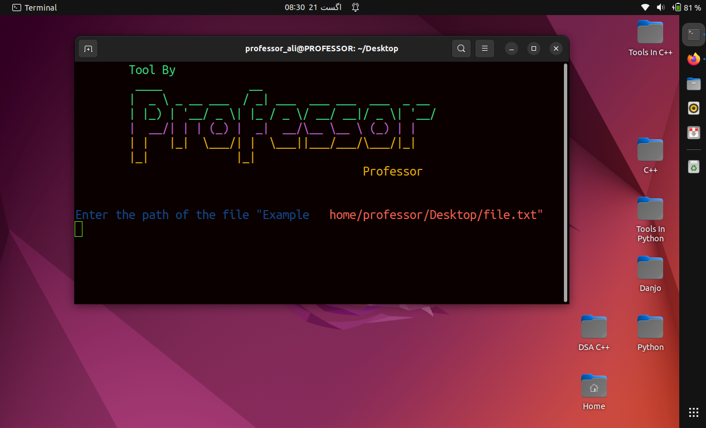

# بسم اللہ الرحمن الرحیم

# Usage
> git clone https://github.com/codewithprofessor/FileController

> cd cd FileController

> python main.py

***
#### First enter the file form which you want to search data, then write the data you want to search, then write the name of new file or set the path. And then no of line you want to print, OKAY